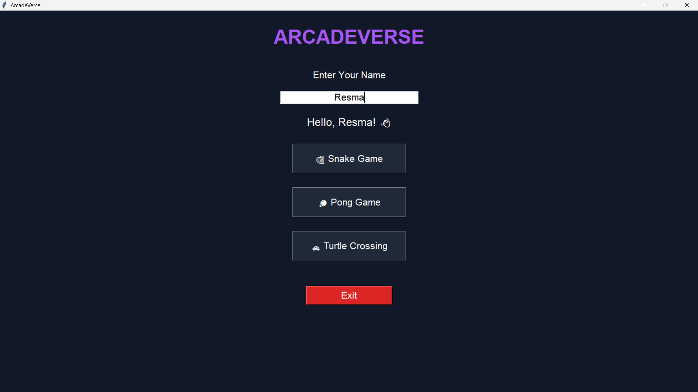
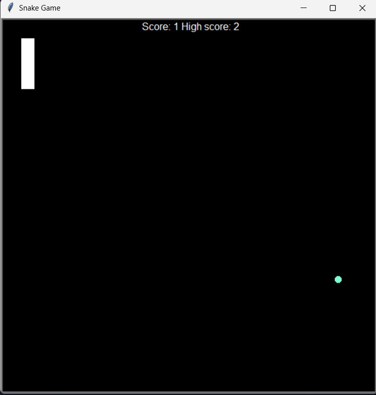
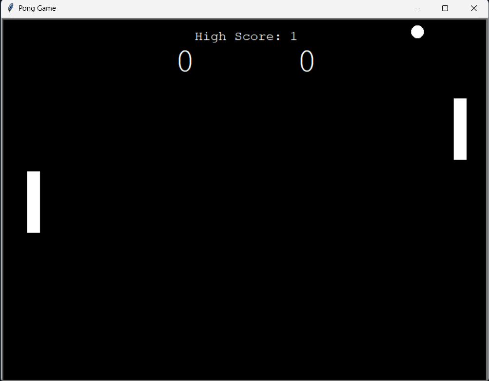
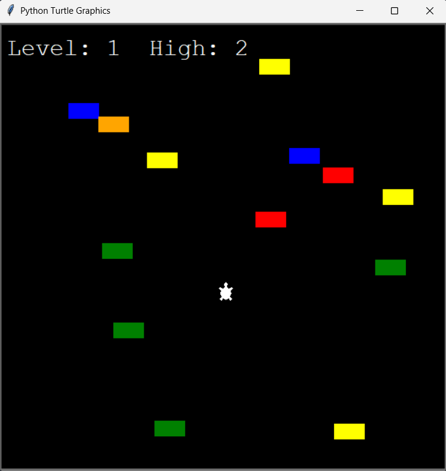

# ArcadeVerse 🎮

ArcadeVerse is a desktop arcade application built using Python, Tkinter and Turtle Graphics. It brings together three classic mini-games in a single launcher.

## Games Included

### 🐍 Snake Game
- Eat food to grow longer
- Avoid colliding with walls and yourself
- Persistent high score tracking

### 🏓 Pong Game
- Two-player gameplay
- Score points against your opponent
- Persistent high score tracking

### 🐢 Turtle Crossing
- Guide the turtle across traffic
- Increasing difficulty with levels
- Level progression system

## Features

- Modern Tkinter launcher
- Player name greeting
- High score persistence using file handling
- Simple and lightweight design
- Easy-to-use game selection menu

## Tech Stack

- Python
- Tkinter
- Turtle Graphics
- Object-Oriented Programming (OOP)
- File Handling

## Project Structure

```text
ArcadeVerse/
│
├── launcher.py
├── player.txt
│
├── snake/
├── pong/
└── crossing/
```

## How to Run

1. Clone the repository
2. Open the project in PyCharm or any Python IDE
3. Run:

```bash
python launcher.py
```

## Screenshots

### 🎮 ArcadeVerse Launcher


### 🐍 Snake Game


### 🏓 Pong Game


### 🐢 Turtle Crossing


## Author

Resma C
